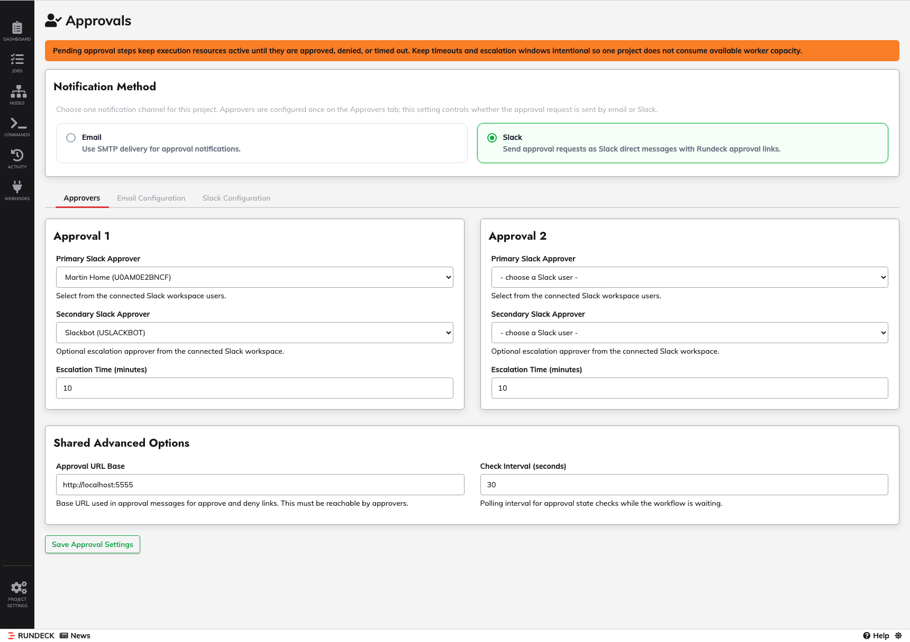
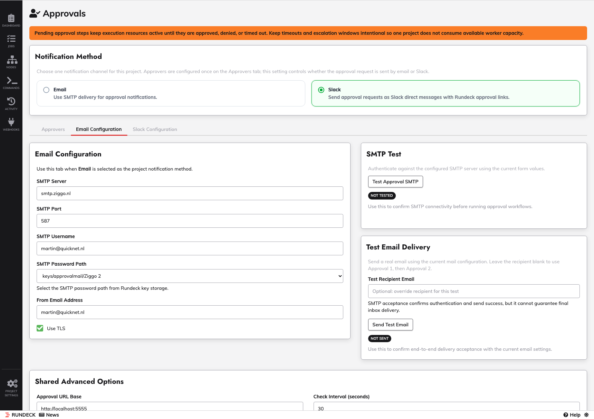
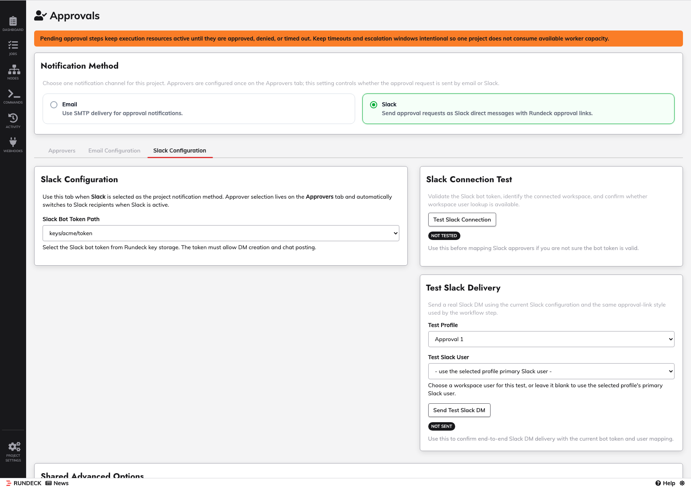

<h1 align="center">Rundeck Approval Job Step Plugin</h1>

<p align="center">
  <strong>Project-scoped approval gates for Rundeck workflows with email or Slack delivery</strong>
</p>

<p align="center">
  <a href="#overview">Overview</a> •
  <a href="#screenshots">Screenshots</a> •
  <a href="#installation">Installation</a> •
  <a href="#configuration">Configuration</a> •
  <a href="#uninstall">Uninstall</a> •
  <a href="#operations-capacity">Operations & Capacity</a>
</p>

<p align="center">
  
  
  
  
</p>

---

## Overview

This plugin adds an **Approval Job Step** to Rundeck workflows.

It lets a workflow pause for human approval using centrally managed, project-scoped approval settings. Notifications can be sent by **email** or **Slack DM**, and approval actions route back through the Rundeck web app.

### Key features

- Workflow step plugin installable as a single JAR
- Project-level approval profiles: `Approval 1` and `Approval 2`
- Delivery by **Email** or **Slack**
- Optional secondary approver escalation
- Timeout behavior with auto-approve or fail/terminate
- Rundeck-hosted approval landing page and approve/deny callbacks
- SMTP and Slack secrets stored in Rundeck Key Storage
- Test actions for SMTP, email delivery, Slack connection, and Slack delivery

## Screenshots

### Project Approvals Overview



### Email Configuration



### Slack Configuration



## Compatibility

| Platform | Version |
|----------|---------|
| Rundeck Community | 5.x |
| Runbook Automation (Self-Hosted) | 5.x |

## Release

- Current version: `3.1.0`
- Artifact: `releases/approval-job-step-3.1.0.jar`
- Release notes: `releases/CHANGELOG-3.1.0.md`

## Installation

Download the latest JAR from [Releases](../../releases) and install it via the Rundeck UI:

1. Open **System Menu** -> **Plugins** -> **Upload Plugin**
2. Select `approval-job-step-3.1.0.jar`
3. Save/upload and reload plugins or restart Rundeck if your environment caches plugins

### Alternative CLI install

```bash
cp releases/approval-job-step-3.1.0.jar "$RDECK_BASE/libext/"
# then reload plugins or restart Rundeck
```

## Configuration

Configure the plugin from the project-level **Approvals** settings page.

### Approvers tab

- `Approval 1`
  - primary approver
  - secondary approver
  - escalation time
- `Approval 2`
  - primary approver
  - secondary approver
  - escalation time

### Email Configuration tab

- SMTP server
- SMTP port
- SMTP username
- SMTP password path
- From email address
- Use TLS
- SMTP connection test
- Test email delivery

### Slack Configuration tab

- Slack bot token path
- Slack connection test
- Slack user selection from workspace users
- Test Slack delivery

### Shared Advanced Options

- Approval URL base
- Check interval

## Workflow Step Usage

Add **Approval Job Step** to a workflow and configure:

- `Approval Profile`
- `Approval Message`
- `Auto-approve on Timeout`

The project-level approval settings control who is notified and how delivery happens.

### Example job definition

- `examples/approval-gate-example.yaml`

## Uninstall

This remains a standard installable/uninstallable Rundeck plugin.

To uninstall:

1. Remove `approval-job-step-3.1.0.jar` from `$RDECK_BASE/libext/`
2. Reload plugins or restart Rundeck

Any saved project approval settings become inactive once the plugin JAR is removed.

## Operations & Capacity

**Important:** Pending approvals keep execution resources active until approved, denied, or timed out.

Operational impact at scale:

- Open approvals consume active execution/worker capacity
- Too many pending approvals can delay other jobs
- Long escalation windows increase how long resources stay reserved
- Keep timeouts and escalation settings intentional and monitored

See:

- `docs/install-and-setup.md`
- `docs/configuration-reference.md`
- `docs/operations-and-capacity.md`
- `docs/troubleshooting.md`

## License

MIT License — see `LICENSE`.

---

<p align="center">
  <sub>Part of <a href="https://github.com/rundecktoolkit">rundecktoolkit</a> — Community plugins for Rundeck</sub>
</p>
